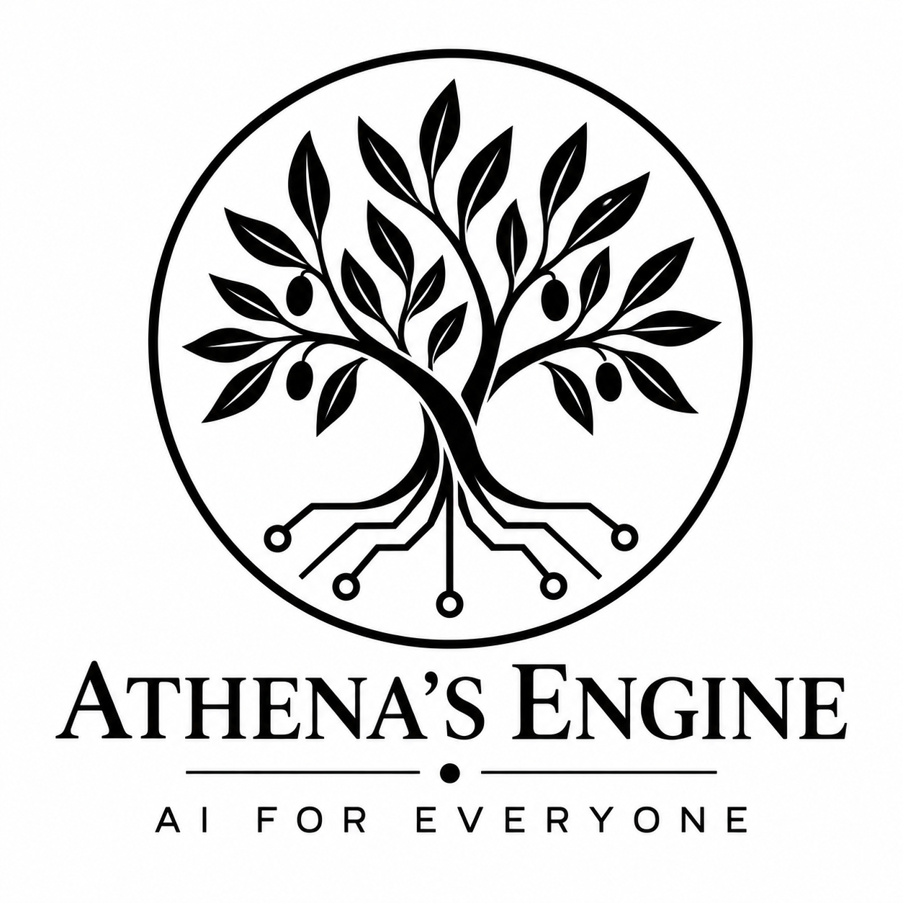
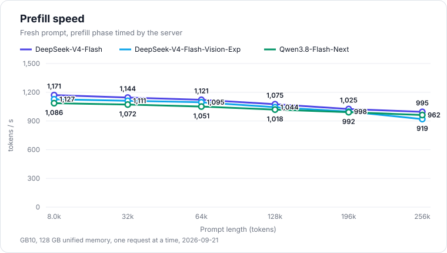
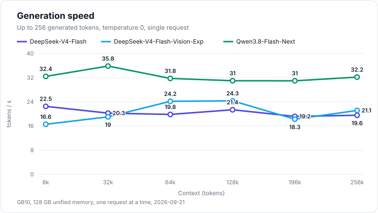
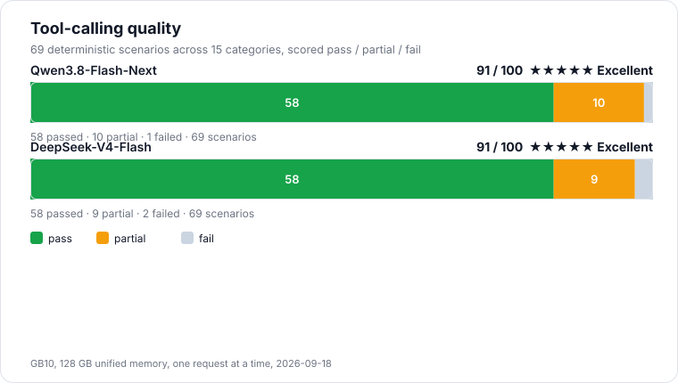

<p align="center">
  
</p>

<h1 align="center">Athena's Engine</h1>

<p align="center">
  <b>AI for everyone.</b><br>
  Frontier language models, running on your desk.
</p>

In the myth, Athena — goddess of wisdom and knowledge — gave humanity the olive
tree, a gift that feeds generation after generation and asks only to be
tended. Our logo is that tree, with roots made of circuits. It stands for the
commitment behind this project: to use knowledge with wisdom, so that its
fruits belong to everyone.

## Why Athena's Engine exists

The most capable language models live in someone else's data center. Using
them means an account, a bill that grows with every word, a usage policy you
did not write — and every prompt, document and line of code leaving your
hands. Running them yourself has meant racks of GPUs that almost nobody owns.

Athena's Engine exists to change that. It runs frontier-class models on a
single NVIDIA GB10 — a DGX Spark or an ASUS Ascent GX10, a computer that fits
on a desk — fast enough for real work: reading long documents, holding long
conversations, driving coding agents. Today it runs **DeepSeek V4 Flash**,
its **Vision-Exp** checkpoint that reads images, and **Qwen3.8 Flash Next**.

**Local.** Your prompts, your documents and your code stay on your machine.
No cloud account, no per-token bill, no one else's terms between you and the
model.

**Within reach.** Advanced AI should not be the privilege of whoever owns a
data center. One desktop machine is enough, and the engine is free for
personal use, research, education, and developers and small companies at work.

## What it does

- **Long context that stays fast.** Prefill holds 920–1,170 tokens/s from 8k
  all the way to the full 256k context, and generation does not slow down as
  the conversation grows.
- **A conversation is not read twice.** Every model keeps its context on
  disk and restores it instead of reading it again: a 141,519-token
  conversation comes back in 1.7 seconds, against two minutes and eighteen
  seconds to read it the first time.
- **Agents that keep their place.** Tool-calling conversations resume from
  the cached prefix turn after turn, and pick up from disk after a server
  restart.
- **Speculative decoding without a quality trade.** DSpark drafts ahead and
  verifies exactly: the output is the same as ordinary decoding, only faster.
- **It reads pictures and documents.** Qwen3.8 Flash Next and DeepSeek V4
  Flash Vision-Exp take images, and PDF, DOCX, Markdown, HTML and plain text
  files, the way the OpenAI API sends them — alongside the text of the
  conversation.
- **Drop-in API.** OpenAI- and Anthropic-compatible endpoints with streaming
  and tool calls, so the tools you already use work unchanged.
- **One name, whichever model is behind it.** The API serves the model as
  `Athena`: configure your clients once, and they keep working when you swap
  DeepSeek for Qwen and back.
- **Every model at hand, if you want them.** Start the engine with two or
  all three of them and a conversation can call another in — `%switch visio`
  when it needs eyes, `%switch deepseek` to go back — watching the release
  and the load as they happen.

## Supported models

| Model | Weights | Context | Speculative decoding | Images and documents |
|---|---|---|---|---|
| DeepSeek V4 Flash | IQ2_XXS mix, Q8 projections and shared experts | 262,144 tokens | DSpark sidecar | — |
| DeepSeek V4 Flash Vision-Exp | IQ2_XXS mix, Q8 projections and shared experts | 262,144 tokens | DSpark drafter | images with `DeepSeek-V4-Flash-Vision-Encoder.gguf`; PDF, DOCX, Markdown, HTML, text |
| Qwen3.8 Flash Next | Unsloth UD-IQ4_XS | 262,144 tokens | MTP head | images with `mmproj-F16.gguf`; PDF, DOCX, Markdown, HTML, text |

Vision-Exp is DeepSeek's experimental checkpoint that reads images. On text
it scores a little below DeepSeek V4 Flash (see
[Doing what it is told](#doing-what-it-is-told)), so the two are best
installed side by side, with a conversation switching to Vision-Exp when it
has pictures to look at.

Model weights are not distributed with the engine. `install.sh` fetches them,
and where they come from and the exact files the release is validated with
are listed in [docs/requirements.md](docs/requirements.md).

## Performance

Every figure below comes from one NVIDIA GB10 with 128 GB of unified memory,
one request at a time, each model in the configuration the launcher ships:
the full 262,144-token context, KV checkpoints on disk, and the model's own
draft — the DSpark sidecar for DeepSeek, the DSpark drafter published with
Vision-Exp, the MTP head for Qwen. The raw data, and the machine and binary
they were taken on, are in [docs/benchmarks/data](docs/benchmarks/data).

### Reading a long document

<p align="center">
  
</p>

The prefill phase as the server times it, on a fresh prompt nobody has asked
before. Between 8k and 256k tokens the rate falls by 11 to 18 per cent —
thirty-two times the context for at most a sixth of the speed.

| Prompt | DeepSeek V4 Flash | DeepSeek V4 Flash Vision-Exp | Qwen3.8 Flash Next |
|---|---|---|---|
| 8k | 1,171 tokens/s | 1,127 tokens/s | 1,086 tokens/s |
| 32k | 1,144 tokens/s | 1,111 tokens/s | 1,072 tokens/s |
| 64k | 1,121 tokens/s | 1,095 tokens/s | 1,051 tokens/s |
| 128k | 1,075 tokens/s | 1,044 tokens/s | 1,018 tokens/s |
| 196k | 1,025 tokens/s | 998 tokens/s | 992 tokens/s |
| 256k | 995 tokens/s | 919 tokens/s | 962 tokens/s |

A quarter of a million tokens — a 700-page book — is read in less than five
minutes.

### Generating an answer

<p align="center">
  
</p>

Generation speed, 256 tokens at temperature 0, measured from the first token
so the reading of the prompt is not counted. What matters here is the shape:
it is flat. No model slows down as the conversation grows — the spread
between neighbouring points is the run-to-run variation, not a trend.

| Context | DeepSeek V4 Flash | DeepSeek V4 Flash Vision-Exp | Qwen3.8 Flash Next |
|---|---|---|---|
| 8k | 22.5 tokens/s | 16.6 tokens/s | 32.4 tokens/s |
| 32k | 20.3 tokens/s | 19.0 tokens/s | 35.8 tokens/s |
| 64k | 19.8 tokens/s | 24.2 tokens/s | 31.8 tokens/s |
| 128k | 21.4 tokens/s | 24.3 tokens/s | 31.0 tokens/s |
| 196k | 19.2 tokens/s | 18.3 tokens/s | 31.0 tokens/s |
| 256k | 19.6 tokens/s | 21.1 tokens/s | 32.2 tokens/s |

Qwen is the fastest because it is the smallest model; DeepSeek V4 Flash
answers at a steady twenty tokens a second whether the conversation holds
eight thousand tokens or a quarter of a million. Vision-Exp averages the
same twenty, but its line moves more: speculative decoding gains only the
drafted tokens that turn out right, and its drafter guesses some answers
better than others. The text is the same either way — every draft is
verified.

### Doing what it is told

Speed is worth nothing if the answers are worse. Every model was put through
[tool-eval-bench](https://github.com/SeraphimSerapis/tool-eval-bench): 69
deterministic scenarios across 15 categories — picking the right tool out of
fifty-two, getting units and dates right, chaining calls, knowing when *not*
to call anything, recovering from tool errors, resisting text that tries to
hijack them, and returning JSON that fits a schema.

<p align="center">
  
</p>

**92 and 91 out of 100 — ★★★★★ Excellent — for Qwen3.8 Flash Next and
DeepSeek V4 Flash, 88 — ★★★★ Good — for Vision-Exp**, on a desktop machine,
from models quantised to two and four bits. Qwen3.8 Flash Next passed 59
scenarios, half-passed 9 and failed 1; DeepSeek V4 Flash passed 58,
half-passed 9 and failed 2; Vision-Exp passed 56, half-passed 9 and failed 4.

All three stumble on the same scenario, and it is worth naming rather than
hiding: a tool result carrying an instruction aimed at the model leaks into
the answer — partial resistance to prompt injection. Vision-Exp goes further
twice: it follows instructions in a file that poses as a system message, and
it makes up internal data it was never given. Everything a tool returns
should be treated as data, not as orders, by whatever you build on top.

The full reports, scenario by scenario, are in
[docs/benchmarks/data](docs/benchmarks/data).

### Coming back to a conversation

A conversation the engine has already read is kept on disk and restored
instead of being read again. A 141,519-token conversation comes back in
**1.7 seconds** after a restart, against the two minutes and eighteen seconds
its first reading took — the file is 619 MB, and it is written while the
session is idle, so the answer in progress pays nothing for it.

## Quick start

1. Download the release archive for `linux-arm64-gb10` from
   [Releases](https://github.com/xangel82/Athena-Engine/releases) and extract it.

2. Get the model files. The installer that came in the archive fetches them
   and writes the environment that points the engine at them:

   ```bash
   ./athena-engine/install.sh                 # asks which model, downloads into ./models
   ./athena-engine/install.sh --model qwen --dir /data/models
   ./athena-engine/install.sh --model both    # Qwen and DeepSeek, so a chat can switch between them
   ./athena-engine/install.sh --model all     # Qwen, DeepSeek and DeepSeek Vision-Exp
   ./athena-engine/install.sh --model deepseek,visio   # any list; the first is the one that starts
   ```

   It downloads about 97 GB for Qwen3.8 Flash Next, 87 GB for DeepSeek V4
   Flash, 94 GB for DeepSeek V4 Flash Vision-Exp, 184 GB for Qwen and
   DeepSeek or 278 GB for all three, checks each file against the checksum
   the repository publishes, and **resumes**: stop it at any point, run the
   same command again, and it carries on from where it stopped rather than
   starting over.

   If the files are already on the machine, point the installer at them
   instead of downloading anything:

   ```bash
   ./athena-engine/install.sh --model qwen --from /mnt/ggufs
   ```

   It looks for each file by name anywhere under that directory, uses it
   where it lies, and fetches only what is missing. Add `--verify` to check
   what is already there against the published checksums.

   DeepSeek V4 Flash's DSpark draft head is not published as a file: the
   installer builds it on the machine, out of the three official weight
   shards, with the converter that came in the archive. It takes a few
   minutes and needs no compiler of yours. Vision-Exp's drafter and image
   encoder are published beside it, so nothing is built for it.

3. Start the engine:

   ```bash
   source models/athena.env
   ./athena-engine/athena-engine.sh
   ```

   Or point it at the files yourself. For DeepSeek V4 Flash:

   ```bash
   export ATHENA_MODEL=/models/DeepSeek-V4-Flash-IQ2XXS-w2Q2K-AProjQ8-SExpQ8-OutQ8-chat-v2-imatrix-0731.gguf
   export ATHENA_DRAFT=/models/DeepSeek-V4-Flash-DSpark-IQ2XXS-Q2K-Q8.gguf
   ./athena-engine/athena-engine.sh
   ```

   For DeepSeek V4 Flash Vision-Exp, with its image encoder:

   ```bash
   export ATHENA_MODEL=/models/DeepSeek-V4-Flash-Vision-Exp-IQ2XXS-w2Q2K-AProjQ8-SExpQ8-OutQ8.gguf
   export ATHENA_DRAFT=/models/DeepSeek-V4-Flash-Vision-Exp-DSpark-support.gguf
   export ATHENA_MMPROJ=/models/DeepSeek-V4-Flash-Vision-Encoder.gguf
   ./athena-engine/athena-engine.sh
   ```

   For Qwen3.8 Flash Next, point at the first part of the model:

   ```bash
   export ATHENA_MODEL=/models/UD-IQ4_XS/Qwen3.8-Flash-Next-UD-IQ4_XS-00001-of-00003.gguf
   export ATHENA_DRAFT=/models/MTP/mtp-Qwen3.8-Flash-Next-shared-Q8_0.gguf
   export ATHENA_MMPROJ=/models/MMPROJ/mmproj-F16.gguf
   ./athena-engine/athena-engine.sh
   ```

   The launcher recognises the model from the file and picks its settings.
   `ATHENA_DRAFT` is optional: it enables speculative decoding.

4. Send a request:

   ```bash
   curl http://localhost:30007/v1/chat/completions \
     -H 'Content-Type: application/json' \
     -d '{"model": "Athena", "messages": [{"role": "user", "content": "Hello!"}]}'
   ```

The launcher reads its settings from the environment: listen address and
port, context length, the directory and disk budget of the KV cache, and
more. They are all described at the top of `athena-engine.sh`.

### Images and documents

Qwen3.8 Flash Next and DeepSeek V4 Flash Vision-Exp look at pictures and
read documents. Both travel the way the OpenAI API sends them — an
`image_url` part with a `data:` URI, a `file` part with the document's
bytes — alongside the text of the conversation. Each model needs its own
image encoder:

```bash
export ATHENA_MMPROJ=/models/MMPROJ/mmproj-F16.gguf                     # Qwen3.8 Flash Next
export ATHENA_MMPROJ=/models/DeepSeek-V4-Flash-Vision-Encoder.gguf      # Vision-Exp
```

Without that variable the model runs text-only, and `GET /v1/models` says so:
`input_modalities` lists `image` only when the encoder is loaded.
`ATHENA_IMAGE_TOKENS` sets how much of the context one picture may take with
Qwen (1024 by default); Vision-Exp's encoder sets its own bound, at most 384
tokens a picture.

A picture costs little: on a short question it adds about 0.7 seconds to the
first token with Vision-Exp and 0.9 to 1.3 seconds with Qwen, a full-size
screenshot included. A conversation that shows the same picture again is not
read again — the cached prefix is reused past it.

Documents need no extra file: PDF, DOCX, Markdown, HTML, JSON and plain text
are read by the engine itself and handed to the model as text. A PDF gives up
its text layer, so a page that is only a scanned photograph yields nothing —
there is no OCR.

### Several models, one engine

You choose what the engine runs: Qwen3.8 Flash Next, DeepSeek V4 Flash,
DeepSeek V4 Flash Vision-Exp, or any two or three of them. With one model it
behaves as any server does. With more, a conversation can ask for another
one and watch it arrive:

```
%switch visio
```

```
Switching to visio.
Flushing checkpoints still being written.
Releasing qwen.
Memory returned: 26.6 GiB (available now 118.3 GiB).
visio needs 87.2 GiB on disk; 118.3 GiB available.
Loading visio.
Ready in 45.1 s.
```

Those lines arrive as each one becomes true, in the reasoning channel of a
streaming reply, so the minute a switch takes is a minute you can watch
rather than a minute of silence. `%switch qwen` and `%switch deepseek` call
the others in; each name is the checkpoint it loads, and asking for the model
already running says so rather than loading it again. A machine that holds
one model of its size cannot hold two, so the engine releases before it
loads, and it checks that the room is really there: if it is not, nothing is
allocated, the model you had comes back, and the answer tells you both
numbers.

A model keeps its own deployment across a switch — DeepSeek device-resident
with its small KV ring, Qwen mapped with the whole context — because a switch
changes the model, not the machine it runs on. Requests that arrive mid-switch
wait for the new model rather than failing.

`./athena-engine/install.sh --model all` writes all of this for you; by hand,
it is the other models named alongside the first:

```bash
export ATHENA_MODEL=/models/UD-IQ4_XS/Qwen3.8-Flash-Next-UD-IQ4_XS-00001-of-00003.gguf
export ATHENA_DRAFT=/models/MTP/mtp-Qwen3.8-Flash-Next-shared-Q8_0.gguf
export ATHENA_MMPROJ=/models/MMPROJ/mmproj-F16.gguf
export ATHENA_MODEL_2=/models/DeepSeek-V4-Flash-IQ2XXS-w2Q2K-AProjQ8-SExpQ8-OutQ8-chat-v2-imatrix-0731.gguf
export ATHENA_DRAFT_2=/models/DeepSeek-V4-Flash-DSpark-IQ2XXS-Q2K-Q8.gguf
export ATHENA_MODEL_3=/models/DeepSeek-V4-Flash-Vision-Exp-IQ2XXS-w2Q2K-AProjQ8-SExpQ8-OutQ8.gguf
export ATHENA_DRAFT_3=/models/DeepSeek-V4-Flash-Vision-Exp-DSpark-support.gguf
export ATHENA_MMPROJ_3=/models/DeepSeek-V4-Flash-Vision-Encoder.gguf
./athena-engine/athena-engine.sh
```

The API still serves one name, `Athena`, whichever model is behind it, so
nothing in your clients changes when the model does.

### In a container

The image carries the engine and the CUDA runtime it is validated against;
the model files stay on the host and are mounted read-only.

```bash
ATHENA_MODELS_DIR=/path/to/models docker compose -f docker/docker-compose.yml up -d
```

It starts DeepSeek V4 Flash. The `environment:` block in
`docker/docker-compose.yml` chooses what runs: Qwen3.8 Flash Next or
Vision-Exp instead, or all three, and then the container answers `%switch`
like any other deployment. Two named volumes keep what should outlive the container:
`/kv`, where conversations are checkpointed, and `/state`. The container
needs the NVIDIA runtime and all GPUs (`--gpus all`), and `memlock`
unlimited.


## API

| Endpoint | Compatible with |
|---|---|
| `POST /v1/chat/completions` | OpenAI Chat Completions, with streaming and tool calls |
| `POST /v1/completions` | OpenAI Completions |
| `POST /v1/responses` | OpenAI Responses |
| `POST /v1/messages` | Anthropic Messages |
| `GET /v1/models` | model list |
| `GET /health` | readiness probe |

Any client that talks to these APIs can use Athena's Engine by changing its
base URL — chat front-ends, coding agents and benchmark tools alike.

### One model name for every model

Whatever model the engine runs, the API serves it as **`Athena`** by default.
Configure your clients once with that name and they keep working when you
switch from DeepSeek to Qwen or back.

If you prefer the real name, set `ATHENA_API_MODEL=model` to serve the model
as `deepseek-v4-flash`, `deepseek-v4-flash-vision` or `qwen3.8-flash-next`,
or `ATHENA_MODEL_NAME` to choose any name you like. The name is matched exactly, capital letters
included: a request for any other model is answered with `404 model_not_found`.

## Requirements

An NVIDIA GB10 with 128 GB of unified memory, DGX OS, and about 93 GB
(DeepSeek V4 Flash), 94 GB (DeepSeek V4 Flash Vision-Exp) or 97 GB (Qwen3.8
Flash Next) of disk for each model's files. The driver and CUDA library
versions the release is validated with are in
[docs/requirements.md](docs/requirements.md).

## A special thanks to antirez

Athena's Engine would not exist without **Salvatore Sanfilippo (antirez)**.
His [ds4](https://github.com/antirez/ds4) — now DwarfStar — showed that an
excellent large language model can run well on hardware a person can own, and
it lit the spark for this project.

Athena's Engine builds on ds4 and on
[DS4-GB10-GX10-DSpark-CUDA](https://github.com/xangel82/DS4-GB10-GX10-DSpark-CUDA),
the fork that brought it to the GB10 with DSpark speculative decoding.
Thank you, Salvatore.

## Licenses and contributions

Athena's Engine is distributed as binaries under the
[PolyForm Strict License 1.0.0](LICENSE.md), with an additional permission for
small companies. In short:

- **Free for noncommercial use** — personal use, research, study, hobby
  projects, and use by schools, public research institutions, charities and
  government bodies.
- **Free for developers and small companies at work** — use inside your own
  business, as a coding assistant, for your agents and your internal tools, if
  your company has fewer than 30 people and less than 500,000 USD in
  yearly revenue.
- **No redistribution, no modified versions, and no offering it to others as a
  product or service.** Download the engine from this repository.
- **Any other commercial use needs a separate license.** Open an issue in this
  repository to get in touch.

This summary is for convenience; the [license text](LICENSE.md) is what applies.

If you publish benchmarks or other results obtained with the engine, please
credit **Athena's Engine by Marco Palaferri**.

Before using the engine, please read:

- [LICENSE.md](LICENSE.md) — the terms under which you may use Athena's Engine.
- [THIRD_PARTY_NOTICES.md](THIRD_PARTY_NOTICES.md) — the open-source
  components it builds on and the notices their licenses require.
- [CONTRIBUTIONS.md](CONTRIBUTIONS.md) — who and what this engine owes its
  existence to, and how you can help: bug reports, benchmark results on your
  own GB10 and feedback are welcome in the issue tracker.
